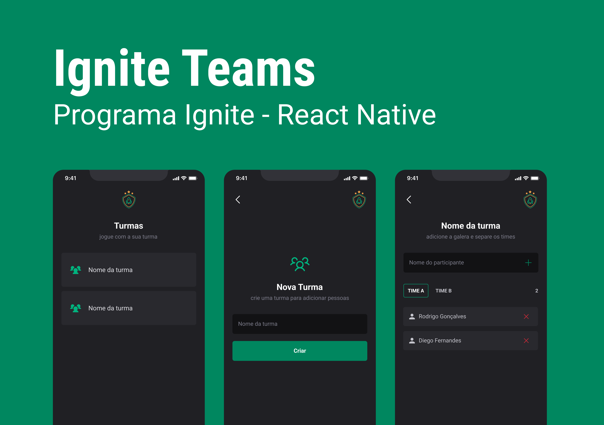

  <a href="#-tecnologias">Tecnologias</a>&nbsp;&nbsp;&nbsp;|&nbsp;&nbsp;&nbsp;
  <a href="#-projeto">Projeto</a>&nbsp;&nbsp;&nbsp;|&nbsp;&nbsp;&nbsp;
  <a href="#-layout">Layout</a>&nbsp;&nbsp;&nbsp;|&nbsp;&nbsp;&nbsp;
  <a href="#memo-licença">Licença</a>

 

  

## 🚀 Tecnologias

Esse projeto foi desenvolvido com as seguintes tecnologias:

- React
- ReactNative
- Typescript
- JavaScript
- Git e Github
- Figma

## 💻 Projeto

O Ignite Teams é um aplicativo de adicionar / remover turmas e participantes para um melhor controle times. 
- Na primeira tela você tem a opção de cria nova turma.
- Clicando em Criar nova turma você sera redirecionado a outra tela. Para adicionar um nome a sua turma;
- Voltando à pagina principal. Voce pode clicar na sua turma para adicionar os participantes.
- A turma é dividida em Times A e B. Pode adicionar e remover quantos times quiser.

